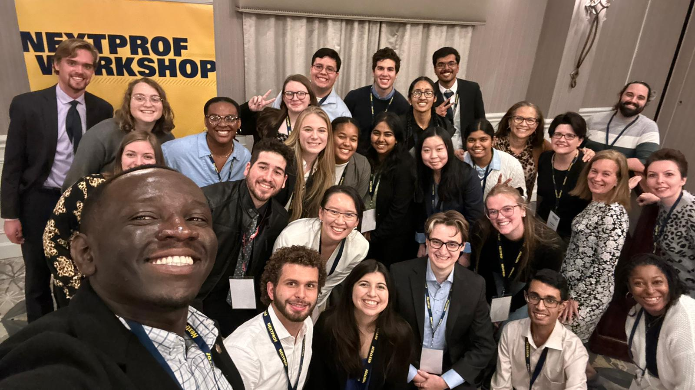

## Undefeated Since 1968: Two Years at UC San Diego

### [Watch the video on YouTube here!](https://youtu.be/zwZPQAnD8tE) (1:11:02)

Over the summer between my bachelor's and master's degrees, I made a documentary about a fascinating two years in the history of UC San Diego. The inspiration for this was learning that [UCSD had a football team for a single season](https://en.wikipedia.org/wiki/1968_UC_San_Diego_Tritons_football_team), in 1968, but as I dug into the [Triton Times (now the Guardian) archives](https://library.ucsd.edu/dc/collection/bb4847930p) from the era, I found that football was just one of a series of fascinating things happening on the UCSD campus. From Reagan to Angela Davis to Herbert Marcuse to Lumumba-Zapata to a broken glass door, the infant university was anything but dull in its early years. And we never talk about it.

After releasing the documentary, [I was featured on the front page of the San Diego Union-Tribune](https://www.sandiegouniontribune.com/news/education/story/2022-10-16/ucsd-football-documentary), in an article by Gary Robbins about my documentary. In addition, I was honored to receive second prize in the Feature Reporting category for College TV/Online Video at the San Diego Press Club Awards.

## NextProf Pathfinder 2023

I was extremely lucky to be invited to the [2023 NextProf Pathfinder Workshop](https://nextprofpathfinder.engin.umich.edu/), hosted by the University of Michigan, and co-sponsored by UC San Diego's Jacobs School of Engineering and Georgia Tech's College of Engineering. At the three-day workshop, I had the chance to meet dozens of like-minded master's and PhD students in engineering from around the country, and learn more about the steps I can take towards my eventual goals of a faculty position. 

This is besides the point, but I also had a great time walking around Ann Arbor, including the best sandwich I've had in years at Zingerman's. (It almost made me forget that my hands were so cold I couldn't move them very fast.)

